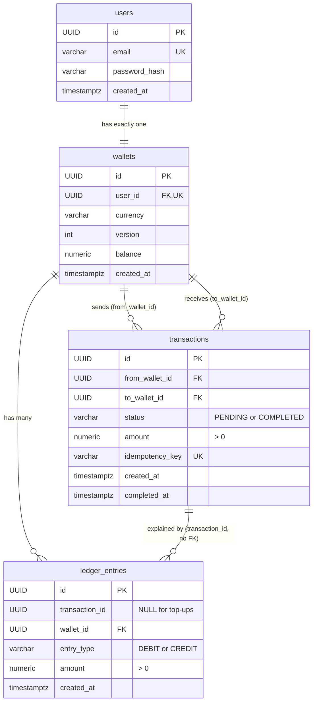
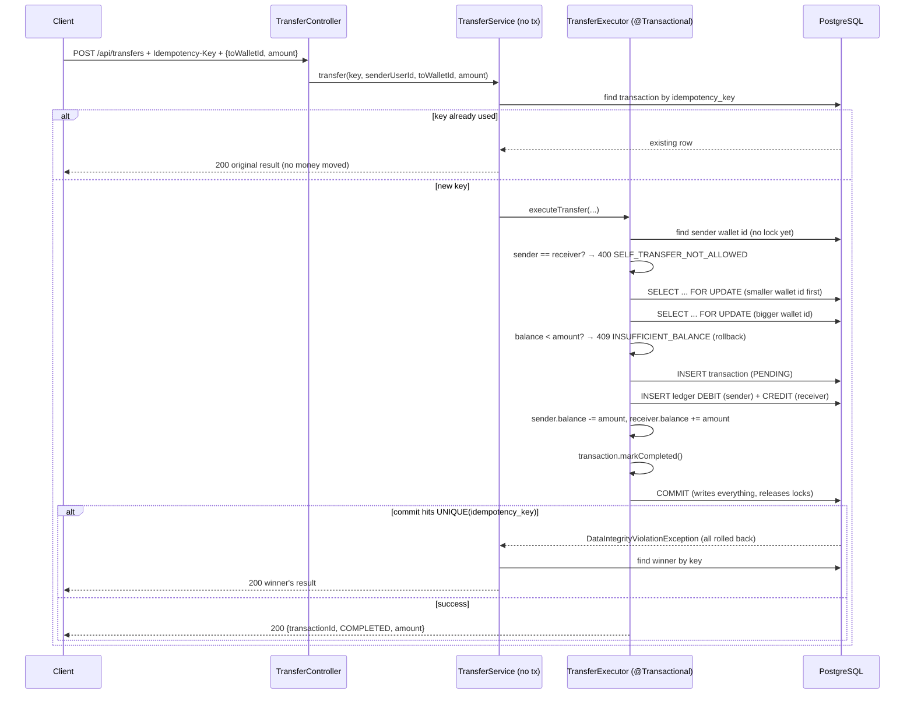

# PayFlow: Project Analysis

> Written on 2026-09-13 against the `master` branch **plus your uncommitted "day 12" work**
> (idempotency keys, row locking, reconciliation, concurrency test).
>
> What I checked for this report:
> - I read every source file, migration, config file and test.
> - `./mvnw test-compile` succeeds.
> - `ConcurrentTransferTest` **passes** (1 test, about 93 s, most of it starting the Postgres container).
> - Your local database (`payflow-postgres` container) has migrations V1–V6 applied, and every wallet's
>   stored balance matches its ledger.
> - I did **not** run `LedgerReconciliationTest` or `PayflowApplicationTests`, because they write to your
>   local dev database. Section 8 explains why `LedgerReconciliationTest` fails as written.

---

## Table of contents

1. [What PayFlow is, in one minute](#1-what-payflow-is-in-one-minute)
2. [The tools it is built with](#2-the-tools-it-is-built-with)
3. [How to run it, step by step](#3-how-to-run-it-step-by-step)
4. [Where everything lives (folder map)](#4-where-everything-lives-folder-map)
5. [The database, table by table](#5-the-database-table-by-table)
6. [The 5 big ideas behind the design](#6-the-5-big-ideas-behind-the-design)
7. [What happens on each request, step by step](#7-what-happens-on-each-request-step-by-step)
8. [The tests](#8-the-tests)
9. [Your uncommitted work and a Git trap to avoid](#9-your-uncommitted-work-and-a-git-trap-to-avoid)
10. [How the project grew (timeline from Git)](#10-how-the-project-grew-timeline-from-git)
11. [Problems found, most serious first](#11-problems-found-most-serious-first)
12. [What is already done well](#12-what-is-already-done-well)
13. [Suggested next steps](#13-suggested-next-steps)
14. [Glossary](#14-glossary)

---

## 1. What PayFlow is, in one minute

PayFlow is the **backend of a digital wallet**, a small version of the server behind apps like PayPal or Paytm.
It has no screens. It is a REST API that other programs (a mobile app, a website, Postman, Swagger UI) call.

A user can:

1. **Register** with an email and password. A wallet with balance `0` (currency USD) is created automatically.
2. **Log in** and get a **JWT token**, like a 1-hour "entry pass".
3. **See their wallet** (balance, currency, id).
4. **Top up** their wallet (add money).
5. **Transfer** money to another wallet.
6. **See their transaction history**, page by page.

Behind the scenes, every money movement is written to a **ledger** (a permanent list of debits and credits), so
the balances can always be checked against it.

---

## 2. The tools it is built with

| Tool | Version | What it does here, in simple words |
|---|---|---|
| **Java** | 21 | The programming language. |
| **Spring Boot** | 4.1.0 | The framework that starts the web server and connects all the pieces together. |
| **Spring Web MVC** | (Boot) | Turns HTTP requests like `POST /api/transfers` into Java method calls. |
| **Spring Data JPA / Hibernate** | (Boot) | Lets Java objects (`User`, `Wallet` …) be saved to and loaded from database tables without hand-written SQL. |
| **PostgreSQL** | 16 | The database where all data is stored. Runs in Docker. |
| **Flyway** | (Boot) | Runs the SQL files in `db/migration` in order (V1, V2, …) so the database structure is always up to date. |
| **Spring Security** | (Boot) | Guards the endpoints: only requests carrying a valid token get through. |
| **JJWT** | 0.12.6 | Creates and checks JWT tokens. |
| **BCrypt** | (Security) | Scrambles passwords one way before storing them, so the real password is never saved. |
| **Bean Validation** | (Boot) | Checks request data (`@NotBlank`, `@Email`, `@Positive`) before your code runs. |
| **springdoc-openapi** | 3.0.3 | Generates the Swagger UI page where you can try the API in a browser. |
| **Testcontainers** | (Boot) | Starts a real, throwaway Postgres in Docker just for a test. |
| **Docker Compose** | n/a | `docker-compose.yml` starts the local Postgres database. |

---

## 3. How to run it, step by step

**Step 1: Start the database**

```bash
docker compose up -d
```

This starts Postgres on `localhost:5432` with user, password and database all set to `payflow`.
The data is kept in a Docker volume named `payflow_pgdata`, so it survives restarts.

**Step 2: Start the application**

```bash
./mvnw spring-boot:run        # Git Bash / macOS / Linux
mvnw.cmd spring-boot:run      # Windows cmd / PowerShell
```

On startup, Flyway runs any new migration files, then Hibernate checks (`ddl-auto: validate`) that your Java
entities match the tables. If they don't match, the app refuses to start. That check is a good safety net.

**Step 3: Open Swagger UI**

Go to <http://localhost:8080/swagger-ui.html>. Every endpoint is listed there and you can call them from the browser.

**Step 4: Try the full flow**

```bash
# 1. Register
curl -X POST localhost:8080/api/users/register -H "Content-Type: application/json" \
     -d '{"email":"alice@example.com","password":"secret123"}'

# 2. Log in and copy the jwtToken from the response
curl -X POST localhost:8080/api/auth/login -H "Content-Type: application/json" \
     -d '{"email":"alice@example.com","password":"secret123"}'

# 3. See your wallet
curl localhost:8080/api/wallets/me -H "Authorization: Bearer <TOKEN>"

# 4. Top up
curl -X POST localhost:8080/api/wallets/me/topup -H "Authorization: Bearer <TOKEN>" \
     -H "Content-Type: application/json" -d '{"amount": 500}'

# 5. Transfer (the Idempotency-Key header is required)
curl -X POST localhost:8080/api/transfers -H "Authorization: Bearer <TOKEN>" \
     -H "Idempotency-Key: 7f1c2a9e-0000-4000-8000-000000000001" \
     -H "Content-Type: application/json" \
     -d '{"toWalletId":"<BOB_WALLET_ID>","amount": 25.50}'

# 6. History, page 0, 10 per page
curl "localhost:8080/api/transactions?page=0&size=10" -H "Authorization: Bearer <TOKEN>"
```

**Step 5: Run the tests**

```bash
./mvnw test
```

Docker must be running. Section 8 covers what each test does and which one is currently broken.

---

## 4. Where everything lives (folder map)

```
payflow/
├── docker-compose.yml               ← starts Postgres
├── pom.xml                          ← list of libraries (dependencies)
└── src/
    ├── main/
    │   ├── resources/
    │   │   ├── application.yaml     ← DB connection, JWT secret, logging
    │   │   └── db/migration/        ← V1..V6 SQL files (Flyway)
    │   └── java/com/payflow/payflow/
    │       ├── PayflowApplication.java   ← the main() that starts everything
    │       ├── controller/          ← HTTP layer: receives requests, returns JSON
    │       ├── service/             ← business rules (the "brain")
    │       ├── repository/          ← talks to the database
    │       ├── entity/              ← Java classes that mirror DB tables
    │       ├── dto/                 ← shapes of request/response JSON
    │       ├── exception/           ← custom errors + the global error handler
    │       ├── security/            ← JWT creation + the filter that checks tokens
    │       ├── configuration/       ← security rules, Swagger setup
    │       └── health/              ← GET /health → "OK"
    └── test/java/com/payflow/payflow/
        ├── PayflowApplicationTests.java       ← "does the app start?"
        └── service/
            ├── ConcurrentTransferTest.java    ← 50 transfers at the same time
            └── LedgerReconcilationTest.java   ← 100 random transfers, then check totals
```

### The layers, in simple words

Think of a bank branch:

| Layer | Bank analogy | Example file |
|---|---|---|
| **Controller** | The front desk. Takes your form, checks it is filled in, and passes it back. | `TransferController.java` |
| **Service** | The bank officer who applies the rules ("do you have enough money?"). | `TransferExecutor.java` |
| **Repository** | The clerk who fetches and files records in the vault. | `WalletRepository.java` |
| **Entity** | One record card in the vault. | `Wallet.java` |
| **DTO** | The printed form handed to or received from the customer. It never exposes internal fields such as `version`. | `WalletResponse.java` |

A request always travels **Controller → Service → Repository → Database**, and the answer travels back the same way.

### All the endpoints

| Method | URL | Login needed? | What it does |
|---|---|---|---|
| GET | `/health` | No | Returns `OK` |
| POST | `/api/users/register` | No | Creates a user and their wallet |
| POST | `/api/auth/login` | No | Returns a JWT token |
| GET | `/api/wallets/me` | Yes | Shows my wallet |
| POST | `/api/wallets/me/topup` | Yes | Adds money to my wallet |
| POST | `/api/transfers` | Yes | Sends money (needs `Idempotency-Key` header) |
| GET | `/api/transactions?page=&size=&sort=` | Yes | My transfers, paged |
| GET | `/swagger-ui.html`, `/v3/api-docs/**` | No | API documentation |

---

## 5. The database, table by table

Flyway runs these files **once each, in order**, and records them in the `flyway_schema_history` table.
**Never edit or rename a migration that has already run.** Flyway stores a checksum of each file and will refuse to
start if an old file changes. Always add a new `V7__...sql` file instead.

| File | What it does |
|---|---|
| `V1__create_users.sql` | Creates `users` (id, unique email, password_hash, created_at). |
| `V2__create_wallets_table.sql` | Creates `wallets`, one per user (`user_id UNIQUE`), with `currency` and a `version` number. |
| `V3__create_ledger_entries.sql` | Adds `balance NUMERIC(19,4)` to wallets. Creates `ledger_entries`, where each row is one DEBIT or CREDIT, and the database itself rejects `amount <= 0`. |
| `V4__create_trasactions.sql` | Creates `transactions` (from wallet, to wallet, amount, status, timestamps). *(The file name has a typo, "trasactions". Leave it alone; renaming it would break Flyway.)* |
| `V5__alter_transactions.sql` | Widens `status` from 6 to 20 characters. `'PENDING'` (7) and `'COMPLETED'` (9) did not fit in 6. |
| `V6__add_idempotency_key_to_transactions.sql` | Adds `idempotency_key` in 4 safe steps: add as nullable → fill old rows → make NOT NULL → make UNIQUE. |

### How the tables connect



In plain words:
- **users**: who you are.
- **wallets**: your money pot. `balance` is the quick-to-read current total.
- **ledger_entries**: the permanent **receipt book**. A new row is added for every money movement, and rows are never changed.
- **transactions**: one row per transfer between two wallets, with its status and idempotency key.

---

## 6. The 5 big ideas behind the design

### Idea 1: Double-entry ledger (the "receipt book")

Every transfer writes **two** ledger rows: a **DEBIT** (money out) on the sender and a **CREDIT** (money in) on the receiver,
both for the same amount. A top-up writes one CREDIT.

A wallet's true balance can therefore always be recomputed as:

```
balance = sum(all CREDITs) − sum(all DEBITs)
```

That is exactly what `LedgerEntryRepository.computeBalanceFromLedger` does. The `wallets.balance` column is a
**shortcut (cache)**, so the app doesn't have to add up every receipt each time you open your wallet.
The ledger is the **source of truth**. If the two ever disagree, something is wrong.

### Idea 2: Reconciliation (checking the shortcut against the receipt book)

`ReconciliationService.reconcile(wallets)` compares each wallet's stored `balance` with the ledger total and returns
the wallets that don't match. An empty list means everything is healthy.
It compares with `compareTo` rather than `equals`, because `100.00` and `100.0000` are equal amounts but
`BigDecimal.equals` says they are different.

### Idea 3: Idempotency (pressing "Pay" twice must not pay twice)

Networks fail. A phone might send "transfer $50", lose the reply, and send it again.
To make that safe, the client puts a unique **`Idempotency-Key`** header on each *intended* payment.
If the same key arrives again, the server returns the **original result** instead of moving money again.
This works on two levels:
1. **Fast check:** before doing anything, look the key up (`TransferService.java:38`).
2. **Hard guarantee:** the database has `UNIQUE (idempotency_key)`, so even if two copies slip past the fast check at the same
   moment, only one row can be saved. The loser's database transaction is rolled back and it returns the winner's result (`TransferService.java:44-48`).

### Idea 4: Row locking (stopping 50 simultaneous transfers from overspending)

Without locking: the balance is 1000, and 50 requests to send 100 each arrive together. All 50 read "1000", all 50 decide "enough money",
all 50 subtract, and the wallet is overdrawn.

With locking (`WalletRepository.findByIdForUpdate`, which runs `SELECT ... FOR UPDATE`), the first request "holds the key" to the wallet row.
The other 49 **wait in line**, and each one reads the real, updated balance when its turn comes. Exactly 10 succeed and 40 are refused.
`ConcurrentTransferTest` proves this, and it passes.

**Deadlock avoidance:** if A→B and B→A happen at the same moment and each locks "sender first", each can end up holding one lock
and waiting forever for the other. The code always locks the **smaller wallet id first** (`TransferExecutor.java:59-63`),
so everyone queues in the same order and that cannot happen.

### Idea 5: Optimistic locking via `@Version`

`Wallet` has a `version` column. Every time Hibernate updates a wallet it runs
`UPDATE ... SET version = version + 1 WHERE id = ? AND version = <old>`. If someone else changed the row in between,
0 rows match and Hibernate throws an error instead of silently overwriting their change.
This protects the top-up path, which does **not** take a row lock (see problem **P6**).

---

## 7. What happens on each request, step by step

### 7.1 Register: `POST /api/users/register`

1. `UserController.register` receives `{email, password}`. `@Valid` checks the email looks like an email and neither field is blank.
   If validation fails, the response is **400 `INVALID_DATA`**.
2. `UserService.register` (inside one database transaction):
   1. If the email already exists, it throws `DuplicateEmailException` → **409 `EMAIL_ALREADY_EXISTS`**.
   2. It hashes the password with BCrypt.
   3. It creates a `User` with a fresh random UUID.
   4. It creates a `Wallet` with a fresh UUID, currency `"USD"` and balance `0`.
   5. It saves both. If anything fails, neither is saved (all or nothing).
3. It returns `{id, email}`. The password hash is never sent back.

### 7.2 Login: `POST /api/auth/login`

1. `AuthController.login` validates `{email, password}`.
2. `AuthService.login`:
   1. It finds the user by email. If none is found → **401 `INVALID_CREDENTIALS`**.
   2. `passwordEncoder.matches(raw, hash)`: if wrong → the **same** 401 message. The message doesn't say which part was wrong, which is good practice.
   3. `JwtService.generateToken(userId)` builds a token whose **subject** is the user id, valid for 1 hour, and signed with the secret key (HMAC-SHA).
3. It returns `{ "jwtToken": "eyJ..." }`.

### 7.3 Every protected request: the JWT filter

`JwtAuthenticationFilter` runs **before** any controller:

1. It reads the `Authorization` header. If it doesn't start with `Bearer `, it lets the request continue as anonymous.
2. It checks the token's signature and expiry (`JwtService.validateAndExtractUserId`).
3. If the token is valid, it stores the user id (a `UUID`) in Spring Security's context. That is how controllers get it through
   `@AuthenticationPrincipal UUID userId`.
4. If the token is expired or invalid, it logs a message and continues as anonymous.
5. `SecurityConfig` then blocks anonymous callers from everything except `/health`, register, login and Swagger.
   (Right now a blocked caller gets **403** rather than 401. See **P9**.)

Sessions are `STATELESS`: the server remembers nothing between requests, and the token alone proves who you are.

### 7.4 View wallet: `GET /api/wallets/me`

1. The controller gets `userId` from the token.
2. `WalletService.getWallet` → `findByUserId`, or **404 `WALLET_NOT_FOUND`**.
3. The response is converted to `WalletResponse` (without the internal `version`).

### 7.5 Top up: `POST /api/wallets/me/topup`

1. It validates that `amount` is present and positive.
2. `WalletService.topUp` (one database transaction):
   1. It loads the wallet by user id (**no row lock**).
   2. It saves one **CREDIT** ledger entry with `transaction_id = NULL`.
   3. `balance = balance + amount`.
   4. At commit, Hibernate writes the new balance with a version check (Idea 5).
3. It returns the updated wallet.

### 7.6 Transfer: `POST /api/transfers` (the most important flow)

The work is split over **two classes on purpose**:

- `TransferService.transfer` has **no** `@Transactional`. It is the "outer" layer that handles idempotency.
- `TransferExecutor.executeTransfer` **is** `@Transactional`. It is the "inner" layer that moves the money.

**Why two classes?** Spring's `@Transactional` only works when the call goes *through* Spring. If a method
calls another `@Transactional` method in the *same* class, the annotation is silently ignored ("self-invocation").
Also, a unique-key violation only shows up when the inner transaction **commits**. The outer method must be
outside that transaction to catch the error and then look up the winning row with a fresh query.



Step by step in words:

1. **Controller:** it reads the `Idempotency-Key` header, the user id from the token, and the validated body (`toWalletId` not null, `amount` positive).
2. **Idempotency fast check** (`TransferService.java:38`): if this key was already used, it returns that old result and stops.
3. **Find the sender's wallet id** with a lightweight query that only returns the id (`findWalletIdByUserId`). This way the wallet
   isn't loaded into memory *before* it is locked, which would risk working with a stale balance.
4. **Self-transfer check:** sending to yourself → **400**.
5. **Lock both wallets** in ascending-id order (Idea 4). If the receiver doesn't exist → **404**.
6. **Balance check**, now safe because the row is locked. If there isn't enough money → **409**, and the rollback frees the locks.
7. **Create the `transactions` row** with status `PENDING` and the idempotency key.
8. **Write the ledger:** a DEBIT on the sender and a CREDIT on the receiver.
9. **Update both cached balances.**
10. **Mark `COMPLETED`**, with `completed_at` set to now.
11. **Commit.** Everything from steps 7–10 is saved together, or none of it is.
12. If the commit fails because another request with the *same key* won the race, the outer layer catches it and returns the winner's result.

### 7.7 History: `GET /api/transactions`

1. It finds my wallet id.
2. `findByFromWalletIdOrToWalletId(my, my, pageable)` returns transfers where I am the sender **or** the receiver.
3. For each row it works out the **direction**: if I sent it, it is `OUTGOING` and the counterparty is the receiver; otherwise it is `INCOMING`.
4. It returns a `Page` (content, total elements, total pages …). The `page`, `size` and `sort` query parameters come from Spring's `Pageable`.

### 7.8 Errors: what the client sees

All errors go through `GlobalExceptionHandler` and come back as `{code, message, timestamp}`:

| Situation | HTTP | code |
|---|---|---|
| Wrong email/password | 401 | `INVALID_CREDENTIALS` |
| Email already registered | 409 | `EMAIL_ALREADY_EXISTS` |
| Body failed `@Valid` | 400 | `INVALID_DATA` |
| Wallet not found | 404 | `WALLET_NOT_FOUND` |
| DB constraint broken | 409 | `DATA_VIOLATION` |
| Not enough money | 409 | `INSUFFICIENT_BALANCE` |
| Send to yourself | 400 | `SELF_TRANSFER_NOT_ALLOWED` |
| **Anything else** | 500 | `INTERNAL_ERROR` |

The last row catches more than it should. See **P5**.

---

## 8. The tests

| Test | Uses | What it proves | Status |
|---|---|---|---|
| `PayflowApplicationTests` | **Your local DB** (localhost:5432) | The app starts. | Needs `docker compose up` first. Not run for this report. |
| `ConcurrentTransferTest` | **Testcontainers** (throwaway Postgres) | 50 transfers of 100 from a wallet holding 1000 at once → exactly 10 succeed, 40 get "insufficient", the balance ends at 0, the receiver has 1000, and the ledger agrees with both balances. | **Passes** (run during this analysis). |
| `LedgerReconcilationTest` (class `LedgerReconciliationTest`) | **Your local DB** | Money is conserved across 100 random transfers and every wallet reconciles. | **Broken** (from reading the code). See below. |

### Why `LedgerReconciliationTest` fails as written

1. **Wrong id passed to top-up** (`LedgerReconcilationTest.java:47`): `walletService.topUp(w.getId(), …)` passes the **wallet** id,
   but `topUp` expects a **user** id. `findByUserId(walletId)` finds nothing → `WalletNotFoundException` on the first loop.
   Fix: `walletService.topUp(user.getId(), …)`.
2. **The same idempotency key for all 100 transfers** (`:70`): `"123"` is used every time. After the first transfer succeeds,
   the other 99 just return the first result and **move no money**, so the test effectively checks one transfer.
   Worse, on a second run the key `"123"` already exists in the database, so **zero** transfers run and the test still passes.
   Fix: `UUID.randomUUID().toString()` per transfer.
3. **Fixed emails** (`:45`): `user0@test.com` … `user4@test.com`. Because it writes to your real dev database, the second run
   fails with `DuplicateEmailException`. Fix: add a UUID to the email, as `ConcurrentTransferTest` does.
4. **It doesn't use Testcontainers**, so it leaves test users in your dev database. Give it the same `@Testcontainers` setup as the concurrency test.
5. The file name `LedgerReconcilationTest.java` is missing an "i" and doesn't match the class name `LedgerReconciliationTest`.
   It compiles only because the class isn't `public`. Rename the file.

**Tip:** to avoid copying the container setup into every test, put it in one shared place. Spring Boot's `@ServiceConnection`
replaces the whole `@DynamicPropertySource` block:

```java
@TestConfiguration(proxyBeanMethods = false)
public class TestcontainersConfig {
    @Bean @ServiceConnection
    PostgreSQLContainer postgres() { return new PostgreSQLContainer("postgres:16"); }
}
// then on each test class:  @SpringBootTest @Import(TestcontainersConfig.class)
```

---

## 9. Your uncommitted work and a Git trap to avoid

`git status` shows your "day 12" work (idempotency, locking, reconciliation, tests) is **not committed yet**, and the
Git staging area is out of sync with the files on disk:

| File | Staging area (what `git commit` would save) | Disk |
|---|---|---|
| `V5__add_idempotency_key_to_transactions.sql` | **staged as a new file** | deleted |
| `V6__add_idempotency_key_to_transactions.sql` | not staged (untracked) | present |
| `ConcurrentTransferTest.java` | not staged (untracked) | present |
| `TransferService.java`, `WalletRepository.java`, `pom.xml`, … | not staged | modified |

**The trap:** if you run plain `git commit` now, the commit will contain **two version-5 migrations**
(`V5__alter_transactions.sql` and `V5__add_idempotency_key…`) and **no V6**. Anyone who clones the repo, including
a CI server or you on a new laptop, gets:
`Found more than one migration with version 5` → the app won't start.

**Stage everything first, then check:**

```bash
git add -A pom.xml src
git status        # V5__add_idempotency… should be gone; V6 and ConcurrentTransferTest should be "new file"
git commit -m "day 12: idempotency keys, pessimistic locking, reconciliation"
```

Small tidy-ups before committing:
- `V6__…sql` line 1 still says `-- V5__add_idempotency_key…` in the comment. Comments are part of the checksum, and V6 has already run on your
  local database, so **leave it**. Otherwise Flyway will complain locally.
- `TransferService.java:45`: the variable `winner` is created and never used, and the same query is run again on the next line. Delete that line.
- `TransferService.java` has leftover unused imports (`Transactional`, `LedgerEntryRepository`, some exceptions).

**Leftover data in your local DB:** 4 rows in `transactions` are still `PENDING`, even though their ledger entries exist and the balances
reconcile. They were created by the day-10 code before `markCompleted()` existed. They are harmless, but your history shows them as
PENDING. Either reset the dev DB (`docker compose down -v`) or fix them once by hand in `psql`.

---

## 10. How the project grew (timeline from Git)

| Date | Commit | What was added |
|---|---|---|
| Jul 27 | stage 0 | Spring Boot project generated |
| Aug 5 | Added basic skeleton | Users, wallets, register, login, JWT service, docker-compose, V1–V2 |
| Aug 16 | controller advice / Validations | Global error handler, custom exceptions, `@Valid` on requests |
| Aug 21 | day 4 | JWT filter, `GET /api/wallets/me` |
| Aug 22 | day 5 | Ledger entries + top-up (V3) |
| Aug 22 | day 6 / day 7 | Swagger with bearer auth, wallet-not-found error, expired-token handling |
| Aug 22–23 | day 10 (+ corrections) | Transfers, `transactions` table (V4), status column fix (V5) |
| Aug 23 | day 11 | Transaction history with pagination, self-transfer check |
| *uncommitted* | "day 12" | Idempotency keys (V6), `TransferExecutor` with row locks in id order, `ReconciliationService`, Testcontainers concurrency test |

---

## 11. Problems found, most serious first

Each item says **what** is wrong, **why it matters** in simple words, and **how to fix it**.

### P1 (High): Amounts with more than 4 decimal places break the ledger

**What:** The database stores money as `NUMERIC(19,4)`, which keeps 4 decimal places and **rounds** anything beyond that.
Nothing limits how many decimals a request can have, and Java does the arithmetic on the unrounded number.

**Example:** the sender has `100.0000` and sends `0.00005`.
- Ledger DEBIT and CREDIT are stored as `0.0001` (rounded up).
- Sender balance: Java computes `99.99995`, and the DB stores `100.0000` (rounded up).
- Receiver balance: `0.0001`.

The receiver gained money, the sender lost none, and the sender's balance no longer matches the ledger. Repeat it to create money from nothing.
Also, `0.00004` rounds to `0.0000`, which breaks the `amount > 0` rule in the database and ends as a **500** error (see P4).

**Fix:** reject extra decimals at the door. For USD, 2 decimals make the most sense:

```java
public record TransferRequest(@NotNull UUID toWalletId,
                              @NotNull @Positive @Digits(integer = 13, fraction = 2) BigDecimal amount) {}
public record TopUpRequest(@NotNull @Positive @Digits(integer = 13, fraction = 2) BigDecimal amount) {}
```

### P2 (High): A retried transfer can get "insufficient balance" even though it succeeded

**What:** Two copies of the same request (same key) arrive together. Both pass the fast check (`TransferService.java:38`), then queue for the
wallet lock. Copy A moves the money and commits. Copy B gets the lock, sees the **new, lower** balance, and, if that isn't enough,
throws `InsufficientBalanceException` **before** it ever reaches the unique-key safety net.

**Why it matters:** the client retried because it never saw the first answer. Now it gets **409 INSUFFICIENT_BALANCE** and believes the
payment failed, even though the money already left the account.

**Fix:** repeat the key check *inside* `executeTransfer`, **right after taking the locks**. Both copies always share the sender's lock,
so B is guaranteed to see A's committed row:

```java
Wallet first  = walletRepository.findByIdForUpdate(firstId)...;
Wallet second = walletRepository.findByIdForUpdate(secondId)...;

Optional<Transaction> already = transactionRepository.findByIdempotencyKey(idempotencyKey);
if (already.isPresent()) {
    return toResponse(already.get());      // duplicate: return the original result
}
// ... balance check and the rest as today
```

Keep the unique constraint and the `catch` as a last line of defence.

### P3 (High): Idempotency keys are shared across all users

**What:** The key is unique across the **whole** table, and the lookup doesn't check who owns it.

**Why it matters:**
- If user B happens to send a key that user A already used, B gets a **200 COMPLETED** response with A's transaction id and amount,
  but **B's money never moves**. B thinks they paid. This also leaks A's data to B.
- If the *same* user reuses a key for a *different* payment (another amount or receiver), they silently get the old result.
- This is likely in practice when clients use simple keys like `"1"` or `"order-5"`.

**Fix:**
1. Add a `V7` migration that makes the key unique **per sender**: drop `uk_transactions_idempotency_key` and add
   `UNIQUE (from_wallet_id, idempotency_key)`.
2. Look it up with `findByFromWalletIdAndIdempotencyKey(senderWalletId, key)`.
3. If a key is found but the amount or receiver differs, return **422 Unprocessable Entity**, as Stripe does.

### P4 (Medium): Any database error during a transfer becomes a misleading 500

**What:** `TransferService.java:44-48` catches **every** `DataIntegrityViolationException` and assumes it was a duplicate key.
If it was something else, the lookup finds nothing and it throws
`IllegalStateException("Idempotency key conflict …")` → **500**.

**Examples that reach this:** an `Idempotency-Key` longer than 255 characters (`value too long`), or an amount like `0.00004` (P1).

**Fix:** validate the header (1–255 characters, for example a UUID) before calling the service, and after catching the exception
re-throw the **original** error if no winning row exists:

```java
} catch (DataIntegrityViolationException e) {
    return transactionRepository.findByIdempotencyKey(idempotencyKey)
            .map(this::toResponse)
            .orElseThrow(() -> e);   // not an idempotency clash: let the real error through
}
```

### P5 (Medium): The catch-all error handler turns normal client mistakes into 500s and logs nothing

**What:** `@ExceptionHandler(Exception.class)` (`GlobalExceptionHandler.java:57`) also catches errors that Spring would normally turn into
400/404/405 responses. It also **doesn't log** anything, so real bugs vanish without a trace.

| Client mistake | Should be | Is now |
|---|---|---|
| Missing `Idempotency-Key` header | 400 | **500** |
| Broken JSON / `toWalletId` not a UUID | 400 | **500** |
| `?sort=nonExistingField` on history | 400 | **500** |
| Unknown URL (with a valid token) | 404 | **500** |
| Wrong HTTP method | 405 | **500** |
| Concurrent top-ups (P6) | 409 | **500** |

**Fix:** add handlers for `MissingRequestHeaderException`, `HttpMessageNotReadableException`,
`ObjectOptimisticLockingFailureException` and `PropertyReferenceException`, or extend Spring's `ResponseEntityExceptionHandler`,
which already maps the standard ones. Log the error in the catch-all:

```java
private static final Logger log = LoggerFactory.getLogger(GlobalExceptionHandler.class);

@ExceptionHandler(Exception.class)
public ResponseEntity<ErrorResponse> handle(Exception ex) {
    log.error("Unhandled error", ex);
}
```

Also, the validation error says only `"Validation failed"`. Add the field names (from `ex.getBindingResult().getFieldErrors()`)
so the client knows *what* to fix.

### P6 (Medium): Top-up doesn't lock the wallet, so it fails with 500 under concurrent use

**What:** `WalletService.topUp` loads the wallet **without** `FOR UPDATE`. If a transfer or another top-up changes the same wallet
at the same moment, the `@Version` check catches it (good, **no money is lost**), but the resulting exception reaches the catch-all → **500**.

**Fix:** use the same pattern as transfers:

```java
UUID walletId = walletRepository.findWalletIdByUserId(userId).orElseThrow(WalletNotFoundException::new);
Wallet wallet = walletRepository.findByIdForUpdate(walletId).orElseThrow(WalletNotFoundException::new);
```

### P7 (Medium, security): The JWT secret has a default value committed to GitHub

**What:** `application.yaml:17` has `${JWT_SECRET:ixpX…}`. If the `JWT_SECRET` environment variable isn't set, this
fallback is used, and it is in the repo pushed to `github.com/bachuruchitha/Payflow`.

**Why it matters:** anyone who knows the secret can **create a valid token for any user id** and move that user's money.
If the repository is public, treat this secret as leaked.

**Fix:** remove the default (`secret: ${JWT_SECRET}`) so the app refuses to start without it, generate a new secret, and
put dev values in a git-ignored `application-local.yaml` or an environment variable. The DB password `payflow` is fine for local
Docker, but it should also come from the environment in any real deployment.

### P8 (Medium): Missing database indexes

**What:** Postgres does **not** automatically index foreign-key columns. The history query filters on `from_wallet_id` / `to_wallet_id`,
and reconciliation filters `ledger_entries` on `wallet_id`. Both read the whole table every time.

**Why it matters:** it is fine with 5 rows but slow with 5 million.

**Fix:** add `V7__add_indexes.sql` (or put it in the same V7 as P3):

```sql
CREATE INDEX idx_transactions_from_wallet ON transactions (from_wallet_id, created_at DESC);
CREATE INDEX idx_transactions_to_wallet   ON transactions (to_wallet_id,   created_at DESC);
CREATE INDEX idx_ledger_entries_wallet    ON ledger_entries (wallet_id);
```

### P9 (Low): Smaller API and security polish

- **403 instead of 401:** with no token or an expired token, Spring Security's default response is **403 Forbidden**. The correct answer is
  **401 Unauthorized**. Add
  `.exceptionHandling(e -> e.authenticationEntryPoint(new HttpStatusEntryPoint(HttpStatus.UNAUTHORIZED)))` in `SecurityConfig`.
- **Password rules:** only `@NotBlank`, so `"a"` is accepted. Add `@Size(min = 8, max = 72)`. BCrypt only reads the first 72 bytes.
- **Email case:** `Alice@x.com` and `alice@x.com` become two accounts. Lower-case emails before saving and looking them up.
- **No login rate limit:** passwords can be guessed without limit.
- **Top-up is free money:** any logged-in user can add any amount. That is fine for learning, but in a real app a top-up must come from a
  payment provider (card or bank), and it should also take an idempotency key.
- **Currency is stored but never checked:** a transfer between a USD and an EUR wallet would be accepted. Everything is USD today, but add the check before
  adding a second currency.
- **History has no default order:** without `sort`, Postgres may return rows in any order, so pages can overlap or skip rows.
  Add `@PageableDefault(size = 20, sort = "createdAt", direction = DESC)`.
- **Transfer returns 200:** `201 Created` is more precise for a newly created transfer (and 200 for an idempotent replay).

### P10 (Low): Code tidiness

- `ReconciliationService` runs **one query per wallet** (N+1). One `GROUP BY wallet_id` query can compute all balances at once.
  It is also only used by a test. A scheduled job (`@Scheduled`) or an admin endpoint would make it useful in production.
- Entities with hand-assigned UUIDs and no `@Version` (`Transaction`, `LedgerEntry`, `User`) make Spring Data's `save()` run an extra
  `SELECT` before every `INSERT`, because it can't tell they are new. Implementing `Persistable<UUID>` with an `isNew()` method removes it.
- `ledger_entries.transaction_id` has no foreign key to `transactions`, so the database can't catch an entry pointing to a missing transfer.
- Leftover tutorial comments: `UserController.java:4-5`, `JwtService.java:1`, `HealthController.java:1`.
- `show-sql: true` and Flyway `DEBUG` logging are fine for development but noisy elsewhere. Put them in a `dev` profile.
- `spring.jpa.open-in-view` isn't set, so Spring logs a warning at every start. Set it to `false` explicitly.
- `JwtAuthenticationFilter` only catches `JwtException`. A validly signed token with a non-UUID subject would throw
  `IllegalArgumentException` from `UUID.fromString`. That can only happen if someone has the secret, but catching it is cheap.

---

## 12. What is already done well

- **Clear layering:** controllers are thin, and business rules live in services. The code is easy to follow.
- **Double-entry ledger plus a reconciliation check.** This is how real payment systems are built.
- **Correct concurrency design:** the lock is taken *before* reading the balance, locks are always taken in id order to prevent deadlocks, and
  the comments explain *why*. The concurrency test proves it with 50 real threads against a real Postgres.
- **Idempotency backed by a database `UNIQUE` constraint**, not only an in-memory check.
- **The `TransferService` / `TransferExecutor` split** avoids the `@Transactional` self-invocation trap and lets the outer layer recover
  from a commit-time conflict.
- **`findWalletIdByUserId` returns only the id**, so the wallet row is locked on its first real read.
- **The V6 migration is safe for existing data:** add nullable → fill → NOT NULL → UNIQUE.
- **Database-level safety rules:** `CHECK (amount > 0)`, `CHECK (entry_type IN …)`, `UNIQUE (user_id)` on wallets.
- **Money is handled with `BigDecimal`** (never `double`) and compared with `compareTo`.
- **`ddl-auto: validate`:** the database structure only changes through Flyway, and Hibernate only checks it.
- **DTOs hide internals:** `version` and `password_hash` never appear in responses.
- **Login gives the same error message** for "no such user" and "wrong password".
- **Stateless JWT authentication** with a Swagger UI that is already set up for bearer tokens.

---

## 13. Suggested next steps

In this order. Each step is small.

1. **Commit day 12 safely:** run `git add -A pom.xml src`, check `git status`, then commit (Section 9).
2. **Fix `LedgerReconciliationTest`:** pass the user id, use unique keys and emails, run it on Testcontainers, and rename the file (Section 8).
3. **Validate money amounts** with `@Digits(fraction = 2)` (P1).
4. **Re-check the idempotency key after taking the locks** (P2) and **scope keys per sender** (P3). Write a test that sends the
   same key twice at the same time with an exactly-sufficient balance, and assert both calls return the same transaction id.
5. **Improve error handling:** add 400/404/409 mappings, logging and field-level validation messages (P4, P5).
6. **Lock the wallet in top-up** (P6).
7. **Remove the default JWT secret** and generate a new one (P7).
8. **Add a V7 migration with indexes** (P8).
9. Then add features: a `FAILED` status, a scheduled reconciliation job, a GitHub Actions workflow that runs `./mvnw test` on each push,
   and a `README.md` with the run steps from Section 3.

---

## 14. Glossary

| Word | Simple meaning |
|---|---|
| **API / REST** | A set of URLs that programs call to ask a server to do things. |
| **Endpoint** | One of those URLs, for example `POST /api/transfers`. |
| **DTO** | The shape of the JSON going in or out. It is a separate class from the database entity. |
| **Entity** | A Java class that maps to one database table. |
| **Repository** | An interface that Spring turns into database queries automatically. |
| **Transaction (DB)** | A group of database changes that are saved together or not at all. (The `transactions` *table* is a different thing: it holds money transfers.) |
| **`@Transactional`** | "Run this method inside one database transaction." |
| **Rollback** | Undo everything the current database transaction did. |
| **Commit** | Make the current database transaction's changes permanent. |
| **Ledger** | An append-only list of every debit and credit. Rows are never edited. |
| **Debit / Credit** | Money out / money in. |
| **Reconciliation** | Checking that stored balances equal the ledger totals. |
| **Idempotency key** | A unique id per intended payment, so retries don't pay twice. |
| **Race condition** | A bug that only appears when two things happen at almost the same moment. |
| **Pessimistic lock (`FOR UPDATE`)** | "I'm using this row; everyone else wait." |
| **Optimistic lock (`@Version`)** | "Save only if nobody changed it since I read it; otherwise fail." |
| **Deadlock** | Two workers each waiting for the other forever. |
| **JWT** | A signed token that proves who you are. The server can check it without storing anything. |
| **BCrypt** | A slow, one-way scrambling of passwords, so leaked hashes are hard to crack. |
| **Flyway migration** | A numbered SQL file that changes the database structure, run once, in order. |
| **Testcontainers** | A library that starts real services (such as Postgres) in Docker for a test and throws them away afterwards. |
| **N+1 queries** | Running one query per item in a loop instead of one query for all of them. |
