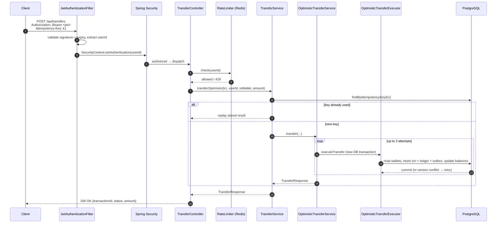
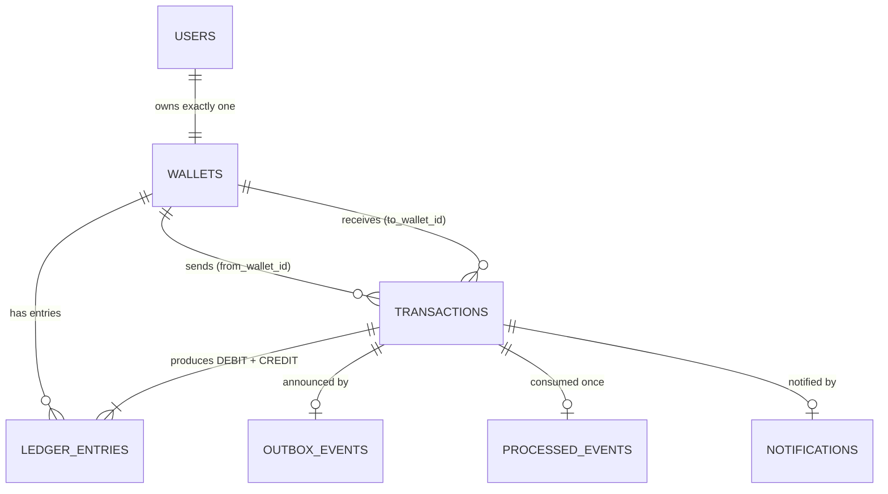

# 01 — Overview & Architecture

## 1.1 What PayFlow is

PayFlow is the **backend of a digital wallet**, similar to the server behind Paytm or Venmo. It has no UI; it exposes a REST API.

What a user can do:

1. **Register** with email and password. A USD wallet with balance 0 is created automatically.
2. **Log in** and receive a **JWT** (a signed token proving who they are).
3. **View their wallet** (id, currency, balance).
4. **Top up** their wallet (add money; there is no real payment gateway, it just credits the wallet).
5. **Transfer** money to another wallet, safely under concurrency, retries and duplicate submissions.
6. **View transaction history**, paginated.
7. In the background, every completed transfer produces a **notification** record through Kafka.

The project is a learning and interview project built day by day (commit messages say "day 4", "day 11", "till day 26").
Most of the engineering effort went into **correctness of money movement**, not into features. The main topics are:

| Concern | Technique used | Chapter |
|---|---|---|
| A balance must never go negative under 50 simultaneous transfers | Row locking (`SELECT … FOR UPDATE`) **or** optimistic locking (`@Version` + retry) | 08 |
| Two transfers in opposite directions must not deadlock | Global lock ordering by wallet id | 08 |
| Pressing "Pay" twice must pay once | `Idempotency-Key` header + DB unique constraint | 09 |
| Every cent must be accounted for | Double-entry ledger + reconciliation | 06 |
| One abusive client must not overload the system | Redis token-bucket rate limiter (Lua, atomic) | 10 |
| Side effects (notifications) must not be lost or duplicated | Transactional outbox + Kafka + idempotent consumer | 12 |
| Caches must never show a balance from a transfer that didn't happen | Evict-after-commit | 11 |

## 1.2 Tech stack

| Layer | Technology | Where it's configured |
|---|---|---|
| Language | Java 21 | `pom.xml` → `<java.version>` |
| Framework | Spring Boot **4.1.0** (Spring Framework 7, Spring Security 7, Jackson 3) | `pom.xml` parent |
| Web | `spring-boot-starter-webmvc` (servlet stack, embedded Tomcat) | — |
| Validation | Jakarta Bean Validation (`@NotNull`, `@Positive`, `@Email`) | DTO records |
| Persistence | Spring Data JPA + Hibernate | `application.yaml` → `spring.jpa` |
| Database | PostgreSQL 16 | `docker-compose.yml` |
| Schema migrations | Flyway (`V1__…` to `V9__…`) | `src/main/resources/db/migration` |
| Security | Spring Security + JJWT 0.12.6 (HMAC-SHA256 JWTs) | `SecurityConfig`, `JwtService` |
| Cache / rate limit | Redis 7.4 via Lettuce + `StringRedisTemplate` | `application.yaml` → `spring.data.redis` |
| Messaging | Apache Kafka 3.8 (KRaft, single broker) + Spring for Apache Kafka | `docker-compose.yml`, Spring Boot defaults |
| API docs | springdoc-openapi 3.0.3 (Swagger UI) | `OpenApiConfig` |
| Tests | JUnit 5, AssertJ, Testcontainers (PostgreSQL) | `src/test` |
| Build | Maven wrapper (`mvnw`) | — |

> **Jackson 3 note:** Spring Boot 4 ships Jackson 3, whose packages moved from `com.fasterxml.jackson.databind` to
> `tools.jackson.databind`. The uncommitted change migrates `OptimisticTransferExecutor` and `TransactionEventConsumer` to
> the new imports. Annotations such as `@JsonProperty` intentionally **stay** in `com.fasterxml.jackson.annotation`
> (Jackson 3 kept that package), which is why `TransferEventPayload` still imports from there.

## 1.3 System architecture

```mermaid
flowchart LR
    Client([HTTP client / Swagger UI])

    subgraph App["PayFlow (Spring Boot, one JVM)"]
        direction TB
        F[JwtAuthenticationFilter] --> C[Controllers]
        C --> S[Services]
        S --> R[Repositories JPA]
        S --> RL[RateLimiter]
        S --> BC[BalanceCache]
        OP[OutboxPublisher<br/>@Scheduled every 5s]
        TC[TransactionEventConsumer<br/>@KafkaListener]
    end

    PG[(PostgreSQL 16<br/>users, wallets, transactions,<br/>ledger_entries, outbox_events,<br/>processed_events, notifications)]
    RD[(Redis 7.4<br/>rate_limit:transfer:*<br/>wallet:balance:*)]
    KF[[Kafka 3.8<br/>topic: transaction-events]]

    Client -->|REST + Bearer JWT| F
    R --> PG
    RL -->|EVALSHA token_bucket.lua| RD
    BC --> RD
    OP -->|reads unpublished rows| PG
    OP -->|send| KF
    KF -->|consume, group notification-service| TC
    TC -->|notifications + processed_events| PG
```

Everything runs in **one Spring Boot process**. The Kafka producer (`OutboxPublisher`) and consumer
(`TransactionEventConsumer`) live in the same app. The consumer's group id is `notification-service`, so it could later be
moved into its own microservice without changing the producer.

## 1.4 Layered structure (packages)

All code is under `src/main/java/com/payflow/payflow/`.

```
payflow/
├── PayflowApplication.java     entry point; @EnableScheduling turns on the outbox poller
├── configuration/              Spring @Configuration classes (security, OpenAPI, rate limiter beans)
├── security/                   JWT creation/validation and the per-request auth filter
├── controller/                 REST endpoints: HTTP in, DTO out. Thin, no business rules
├── health/                     GET /health liveness endpoint
├── dto/                        Request/response records + Kafka event payload
├── service/                    Business logic, transactions, locking, rate limiting, events
├── entity/                     JPA entities (one per table) + enums
├── repository/                 Spring Data JPA interfaces (queries, locks)
└── exception/                  Custom exceptions + GlobalExceptionHandler (→ HTTP status)

src/main/resources/
├── application.yaml            all runtime configuration
├── db/migration/V1..V9         Flyway SQL migrations (the real schema)
└── scripts/token_bucket.lua    the rate limiter algorithm, executed inside Redis
```

### Responsibility of each layer

| Layer | Rule it follows | Example |
|---|---|---|
| **Controller** | Only translates HTTP ↔ Java: reads headers/body/principal, calls one service method, wraps the result. | `WalletController.getMyWallet` turns a `Wallet` entity into a `WalletResponse` DTO |
| **Service** | Owns business rules and **transaction boundaries** (`@Transactional`). | `TransferExecutor.executeTransfer` does lock → check → write → commit |
| **Repository** | Only data access. Custom queries and lock hints live here. | `WalletRepository.findByIdForUpdate` carries `@Lock(PESSIMISTIC_WRITE)` |
| **Entity** | Mirrors a table; no business logic except small state changes. | `Transaction.markCompleted()` |
| **DTO** | What crosses the API boundary; entities are never returned directly. | `WalletResponse` deliberately has no `version` field |
| **Exception** | Domain exceptions carry meaning; one handler maps them to HTTP. | `InsufficientBalanceException` → `409 INSUFFICIENT_BALANCE` |

## 1.5 How a request travels through the code

Here is the lifecycle of an authenticated request, using `POST /api/transfers` (details in chapter 07):



Things that happen around every request:

- **Validation:** `@Valid` on the request body runs Bean Validation *before* the controller method body. A violation throws
  `MethodArgumentNotValidException` → `400 INVALID_DATA`.
- **Authentication principal:** the filter stores the user's `UUID` as the principal, so controllers receive it via
  `@AuthenticationPrincipal UUID userId`. There is no `UserDetails` object and no DB lookup per request.
- **Exceptions:** anything thrown from a controller or service goes to `GlobalExceptionHandler` (chapter 14).

## 1.6 The domain model in one picture



- A **user** has exactly one **wallet** (enforced by `wallets.user_id UNIQUE`).
- A **transaction** is a transfer between two wallets.
- Each transaction writes two **ledger entries**: a DEBIT on the sender and a CREDIT on the receiver. A top-up writes one
  CREDIT with no transaction.
- The outbox/processed/notification tables support the event pipeline (chapter 12).

Full schema: chapter 03.

## 1.7 Key design principles (the "why" behind the code)

These rules appear again and again in the code comments and in `DECISIONS.md`:

1. **The stored `wallets.balance` column is the source of truth for decisions; the ledger is the audit trail.** Only a
   locked row can serialise the overdraft check (chapter 06).
2. **Every write path updates the balance *and* appends ledger entries in the same DB transaction.** Reconciliation relies on this.
3. **Correctness is enforced by the database, not by Java.** Row locks, version checks, unique constraints and `CHECK`
   constraints are the final guards. Java-side checks are fast paths.
4. **Protective infrastructure fails open; money-correctness fails closed.** If Redis dies, transfers still work
   (unthrottled). If a version check fails, the transfer is rolled back (chapter 10).
5. **Side effects happen after commit.** Cache eviction runs in an `afterCommit` hook, and Kafka publishing reads from the outbox
   after the transfer has committed (chapters 11, 12).
6. **Measure trade-offs instead of arguing them.** Both locking strategies exist side by side, with a benchmark test (chapter 08).
