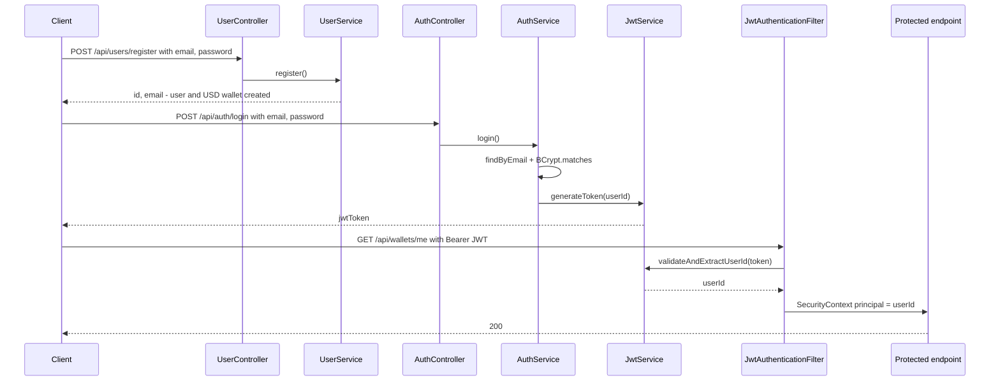

# 04 — Authentication & Security

**Files:** `controller/UserController.java`, `controller/AuthController.java`, `service/UserService.java`,
`service/AuthService.java`, `security/JwtService.java`, `security/JwtAuthenticationFilter.java`,
`configuration/SecurityConfig.java`, `configuration/OpenApiConfig.java`, `dto/RegisterRequest|Response`, `dto/LoginRequest|Response`

## 4.1 The big picture

PayFlow uses **stateless JWT bearer authentication**:

1. The user logs in once with email + password.
2. The server returns a signed token containing the user id and an expiry.
3. Every later request sends `Authorization: Bearer <token>`.
4. The server checks the signature and expiry. It keeps **no session** and needs **no DB lookup** to authenticate.



## 4.2 Registration: `POST /api/users/register`

`UserService.register` (`@Transactional`):

1. `existsByEmail(email)`: if the email is taken, throw `DuplicateEmailException` → **409 `EMAIL_ALREADY_EXISTS`**.
2. Hash the password with **BCrypt** (`passwordEncoder.encode`).
3. Create a `User` and a `Wallet(currency = "USD", balance = 0)` with fresh UUIDs.
4. Save both **in one transaction**, so a user can never exist without a wallet.
5. Return `RegisterResponse(id, email)`. The hash is never returned.

Validation (`RegisterRequest`): `@NotBlank @Email email`, `@NotBlank password`. There are no password strength rules.

**Race condition, handled by the DB:** two simultaneous registrations with the same email can both pass `existsByEmail`. The
`UNIQUE` constraint on `users.email` stops the second one. That surfaces as `DataIntegrityViolationException` →
**409 `DATA_VIOLATION`** (a different code than the normal duplicate path, but still safe).

### Why BCrypt

- It is **slow on purpose** (cost factor 10 by default = 2¹⁰ rounds), so brute-forcing a leaked hash is expensive.
- It **salts** automatically: the same password gives a different hash for each user, which defeats precomputed rainbow tables.
- The salt and cost are stored inside the hash string, so `matches()` needs nothing else.

`SecurityConfig` exposes the bean as `BCryptPasswordEncoder`. Services depend on the `PasswordEncoder` **interface**, so the
algorithm can be swapped later.

## 4.3 Login: `POST /api/auth/login`

`AuthService.login`:

1. `findByEmail(email)`. If there is no user → `InvalidCredentialsException`.
2. `passwordEncoder.matches(raw, hash)`. If it doesn't match → the **same** `InvalidCredentialsException`.
3. `jwtService.generateToken(user.getId())` → `LoginResponse(jwtToken)`.

Both failure cases return **401 `INVALID_CREDENTIALS`** with the message *"Incorrect email or password"*. Using one message
for both avoids **user enumeration** (an attacker can't learn which emails are registered from the message). The response
*time* still differs slightly, because BCrypt only runs when the user exists.

## 4.4 JWTs: `JwtService`

### Creating a token

```java
Jwts.builder()
    .subject(userId.toString())      // "sub": who this token is about
    .issuedAt(now)                   // "iat"
    .expiration(now + 1h)            // "exp"  (payflow.jwt.expiration-ms)
    .signWith(signingKey)            // HMAC-SHA256 signature
    .compact();
```

A JWT has three base64url parts: `header.payload.signature`. Example payload:

```json
{ "sub": "7c1e…-uuid", "iat": 1758441600, "exp": 1758445200 }
```

The payload is only **encoded, not encrypted**. Anyone can read it. The signature stops anyone from *changing* it: without
the secret key, a modified token fails verification.

### The key

In the constructor, the base64 `payflow.jwt.secret` is decoded **once** and wrapped with `Keys.hmacShaKeyFor(...)`. The
decoded secret is 32 bytes (256 bits), so JJWT picks **HS256**. JJWT refuses keys shorter than the algorithm needs.

### Validating a token

```java
Jwts.parser().verifyWith(signingKey).build().parseSignedClaims(token).getPayload().getSubject()
```

`parseSignedClaims` checks the **signature** and the **expiry** and throws otherwise:
- `ExpiredJwtException` when `exp` has passed.
- A `JwtException` subclass for a bad signature, a malformed token, or an unsupported algorithm.

## 4.5 The filter: `JwtAuthenticationFilter`

A `OncePerRequestFilter` (runs exactly once per request), registered **before** Spring's
`UsernamePasswordAuthenticationFilter`.

```
header = Authorization
if header missing or not "Bearer …"  → continue the chain unauthenticated
token = header.substring(7)
try:
    userId = jwtService.validateAndExtractUserId(token)
    SecurityContext.setAuthentication(new UsernamePasswordAuthenticationToken(userId, null, no authorities))
catch ExpiredJwtException → log INFO "Token is expired"
catch JwtException        → log WARN "Invalid token"
continue the chain
```

Things to notice:

- **The principal is the raw `UUID`**, not a `UserDetails`. That's why controllers can write
  `@AuthenticationPrincipal UUID userId`.
- **The filter never rejects a request itself.** A bad or expired token just leaves the request unauthenticated, and the
  authorization rules in `SecurityConfig` decide. For protected endpoints the result is **403 Forbidden** (Spring Security's
  default entry point when no login mechanism such as form or HTTP Basic is configured). REST APIs usually return **401**
  here. See chapter 17.
- **No authorities/roles** (`List.of()`). Every authenticated user can call every protected endpoint. There are no admins.
- **No DB lookup**: a token stays valid for its full hour even if the user were deleted. There is no logout or revocation list.

## 4.6 Authorization rules: `SecurityConfig`

```java
http.csrf(csrf -> csrf.disable())
    .authorizeHttpRequests(auth -> auth
        .requestMatchers("/health", "/api/users/register", "/api/auth/login",
                         "/swagger-ui/**", "/swagger-ui.html", "/v3/api-docs/**").permitAll()
        .anyRequest().authenticated())
    .sessionManagement(sm -> sm.sessionCreationPolicy(STATELESS))
    .addFilterBefore(jwtAuthenticationFilter, UsernamePasswordAuthenticationFilter.class);
```

| Setting | Meaning | Why |
|---|---|---|
| `csrf.disable()` | No CSRF tokens | CSRF attacks abuse cookies that browsers send automatically. This API authenticates with a header the browser never adds by itself, so CSRF doesn't apply |
| `permitAll` list | Public endpoints | You can't require a token to obtain a token, and docs/health should be reachable |
| `anyRequest().authenticated()` | Everything else needs a valid JWT | Deny by default: a new endpoint is protected unless explicitly opened |
| `STATELESS` | Never create an `HttpSession` | Each request stands alone, so the app scales horizontally without sticky sessions |

**Authorization inside the business logic:** the endpoints never take a *user id* or *source wallet id* from the request.
The sender is always the authenticated principal (`@AuthenticationPrincipal`), and the source wallet is looked up from it.
So a user **cannot** move money out of someone else's wallet by editing the request. This is the most important access-control
property in the app.

## 4.7 Swagger integration: `OpenApiConfig`

```java
@OpenAPIDefinition(security = @SecurityRequirement(name = "bearerAuth"))
@SecurityScheme(name = "bearerAuth", type = HTTP, scheme = "bearer", bearerFormat = "JWT")
```

This declares one HTTP-bearer scheme and applies it to every operation, so Swagger UI shows an **Authorize** button and sends
the token on every call.

## 4.8 Security summary: what's good, what's missing

| ✅ Done well | ⚠️ Gap (details in chapter 17) |
|---|---|
| BCrypt, salted, interface-based | JWT secret has a default committed to git |
| Same error for unknown email / wrong password | Invalid/missing token → 403 instead of 401, and the response has no JSON body |
| Deny-by-default authorization | No roles, no refresh tokens, no revocation |
| Sender always comes from the token, never the body | No password policy; email uniqueness is case-sensitive |
| Stateless, CSRF correctly disabled for a header-auth API | Login and register are not rate-limited (only transfers are) |

---

## 4.9 Fundamentals: going deeper (interview follow-ups)

### Anatomy of the security filter chain
Spring Security is a chain of servlet filters that runs **before** your controllers (and before `@ControllerAdvice` can see anything).
Simplified order for a PayFlow request:

1. `SecurityContextHolderFilter`: sets up an empty security context for this request (thread-local).
2. **`JwtAuthenticationFilter`** (ours): fills the context if the token is valid.
3. `ExceptionTranslationFilter`: catches access-denied errors and calls the *authentication entry point* (the default here writes 403).
4. `AuthorizationFilter`: applies `permitAll` / `authenticated()` rules.
5. → `DispatcherServlet` → controller.

Because security errors happen in filters, they never reach `GlobalExceptionHandler`. That's why a bad token gives an empty 403, not an
`ErrorResponse` JSON.

### The SecurityContext is thread-local
The authentication is stored per thread for the duration of the request and cleared afterwards. Consequence: if you start your own
thread or `@Async` task, the principal isn't there unless you propagate it.

### Access token + refresh token (the standard production design)
| Token | Lifetime | Stored | Purpose |
|---|---|---|---|
| Access token (JWT) | 5–15 min | Client memory | Sent on every request; verified statelessly |
| Refresh token | Days/weeks | Server-side (DB/Redis) + client (HttpOnly cookie) | Exchanged for a new access token; **revocable**; rotated on each use |

Short access tokens limit the damage of a stolen token. The server-side refresh token gives you logout and revocation without a DB hit
on every request. PayFlow currently has only a 1-hour access token.

### Revocation strategies
- **Denylist** revoked token ids (`jti` claim) in Redis with TTL = remaining token life.
- **Token version:** store `tokenVersion` per user, embed it in the JWT, and bump it on logout or password change. Every request
  compares them (one lookup, which can be cached).
- **Short expiry + refresh** (above), which is the usual answer.

### HS256 vs RS256 / ES256
- **HS256** (what PayFlow uses): one shared secret signs *and* verifies. Anyone who can verify can also forge. Fine for one service.
- **RS256/ES256:** a private key signs, a public key verifies. Other microservices verify without being able to mint tokens. Keys are
  published via a **JWKS** endpoint, and rotation works by key id (`kid`).

### Where should a browser store the token?
- **HttpOnly, Secure, SameSite cookie:** JavaScript can't read it (XSS-resistant), but the browser sends it automatically, so you
  need CSRF protection again.
- **Memory / localStorage:** no CSRF risk, but readable by any XSS script.

For a pure API used by mobile apps (PayFlow's shape), the `Authorization` header is standard.

### Password storage hierarchy
Plain text ❌ → fast hash (MD5/SHA-256) ❌ (GPUs try billions per second) → **slow, salted, adaptive hash**: BCrypt ✅, scrypt ✅,
**Argon2id** ✅ (the current OWASP first choice). Spring's `DelegatingPasswordEncoder` stores the algorithm id with the hash
(`{bcrypt}$2a$…`), so you can migrate algorithms gradually.

### Common JWT attacks to mention
- **`alg: none`**: a token claims to be unsigned. JJWT's `verifyWith(key)` rejects it.
- **Algorithm confusion:** an RS256 public key is used as an HS256 secret. Avoided by fixing the expected key type/algorithm.
- **Weak secret:** a brute-forceable HMAC key. JJWT enforces a minimum key length, but a **leaked** key (like a committed default) defeats everything.
