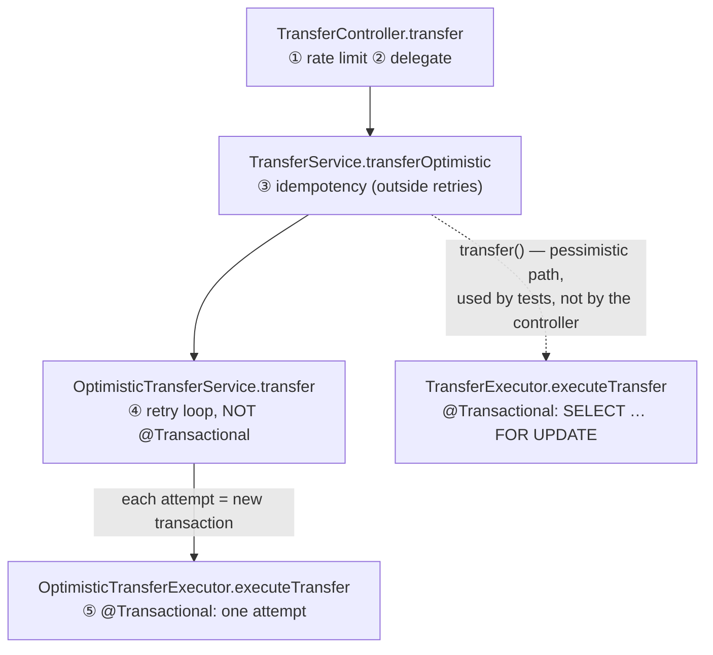

# 07 — Transfers: End-to-End Flow

**Files:** `controller/TransferController.java`, `service/TransferService.java`, `service/OptimisticTransferService.java`,
`service/OptimisticTransferExecutor.java`, `service/TransferExecutor.java`, `dto/TransferRequest.java`, `dto/TransferResponse.java`

This is the most important flow in PayFlow. Every technique in the project meets here: authentication, rate limiting,
idempotency, locking, the ledger, cache eviction and the outbox.

## 7.1 The request

```http
POST /api/transfers
Authorization: Bearer <jwt>
Idempotency-Key: order-001
Content-Type: application/json

{ "toWalletId": "9d2c…", "amount": 100.00 }
```

- `toWalletId`: the **receiver's wallet id** (`@NotNull UUID`).
- `amount`: `@NotNull @Positive BigDecimal`.
- `Idempotency-Key` header: **required** (`@RequestHeader`). The client generates it once per logical payment and reuses it on retries.
- The **sender** is not in the body. It's the authenticated user from the JWT.

Success response `200 OK`:

```json
{ "transactionId": "5a8e…", "status": "COMPLETED", "amount": 100.00 }
```

## 7.2 The call chain

Four classes sit between HTTP and the database. Each has one job:



> **Which path is live?** In the **uncommitted** working tree, the controller calls `transferOptimistic` (see the comment at
> `TransferController.java:42-45`). The reason: only the optimistic executor writes the `OutboxEvent`, so only that path produces
> Kafka events and notifications. In the last commit, the controller still called the pessimistic `transfer`. Both paths remain
> in the code on purpose, for comparison (chapter 08, `DECISIONS.md` Day 19).

### Why is it split into so many classes?

It comes down to **how Spring's `@Transactional` works**: through a **proxy** that wraps calls coming from *another* bean.

- The optimistic version conflict is detected **at commit**, and the commit happens inside the proxy **after** the method returns. The
  method can't catch its own conflict, so the retry loop has to live **outside**, in a different bean
  (`OptimisticTransferService`).
- That outer bean must **not** be `@Transactional`. Otherwise every retry would join the same outer transaction, which is already
  marked rollback-only and has stale entities cached in its persistence context, and every attempt would fail the same way.
- Idempotency sits **outside the retry loop** (`TransferService`), so a duplicate key is replayed once rather than retried.
- Self-invocation (`this.executeTransfer()`) would bypass the proxy and get **no transaction at all**. The separate beans avoid
  this trap.

## 7.3 Step by step (optimistic path, the live one)

### ① Rate limit: `TransferController.java:37-40`

```java
RateLimitResult rateLimit = rateLimiter.check(senderId.toString());
if (!rateLimit.allowed()) throw new TooManyRequestsException(rateLimiter.retryAfterSeconds(rateLimit));
```

This runs first, before any DB transaction or lock. The bucket is keyed on the **authenticated user**, never on anything in the body,
so a caller can't pick a fresh bucket per request. Rejection → `429` with a `Retry-After` header (chapter 10).

### ③ Idempotency: `TransferService.withIdempotency` (`TransferService.java:53-65`)

```java
existing = transactionRepository.findByIdempotencyKey(key);
if (existing.isPresent()) return toResponse(existing.get());      // fast path: replay
try {
    return execute.get();                                           // run the transfer
} catch (DataIntegrityViolationException e) {                       // lost a race on the UNIQUE key
    return toResponse(transactionRepository.findByIdempotencyKey(key).orElseThrow(IllegalStateException::new));
}
```

Two layers: a fast lookup, and the DB `UNIQUE` constraint as the real guarantee. Full explanation in chapter 09.

### ④ Retry loop: `OptimisticTransferService.transfer`

```java
for attempt in 1..3:
    try   { return executor.executeTransfer(...); }         // through the proxy → new transaction
    catch (ObjectOptimisticLockingFailureException e) {       // ONLY this is retried
        if attempt < 3: sleep(random 1..20*attempt ms)        // jittered backoff
    }
throw new TransferConflictException(3, lastConflict);        // → 409 TRANSFER_CONFLICT
```

- **Only version conflicts are retried.** A retry can fix them, because someone else changed the wallet and a fresh read will see it.
- **Business errors are not retried** (`InsufficientBalance`, `SelfTransferNotAllowed`, `WalletNotFound`). The same request
  against the same data fails the same way every time.
- **Jitter** (a random sleep) keeps the transfers that just collided from retrying in lockstep and colliding again.
- **3 attempts, then give up:** a wallet that keeps losing is a hot row, where optimistic locking is the wrong tool (chapter 08).
  It fails fast instead of tying up a request thread.
- After `TransferConflictException` **nothing was committed**, so the client can safely retry with the same key.

### ⑤ One attempt: `OptimisticTransferExecutor.executeTransfer` (`@Transactional`)

| Step | Code | Notes |
|---|---|---|
| a. Resolve sender wallet id | `findWalletIdByUserId(senderId)` | Loads only the id, not the entity. Missing → `WalletNotFoundException` (404) |
| b. Reject self-transfer | `senderWalletId.equals(receiverWalletId)` | → `SelfTransferNotAllowedException` (400) |
| c. Load both wallets **in ascending id order** | `findById(firstId)`, `findById(secondId)` | No lock. The order still matters: Hibernate flushes UPDATEs in load order, and a fixed order prevents deadlocks at commit (chapter 08) |
| d. Balance check | `senderWallet.getBalance().compareTo(amount) < 0` | → `InsufficientBalanceException` (409). The value may be stale, but the version check at commit catches that |
| e. Insert transaction | `new Transaction(…, PENDING, idempotencyKey)` | |
| f. Insert ledger entries | DEBIT on sender, CREDIT on receiver | Chapter 06 |
| g. Update both balances | `setBalance(...)` ×2 | Hibernate adds `AND version = ?` and increments the version automatically |
| h. Mark completed | `transaction.markCompleted()` | Sets `COMPLETED` + `completed_at`. Dirty-checked, so no explicit save |
| i. Write outbox event | `outboxEventRepository.save(new OutboxEvent(…, json))` | JSON of `TransferEventPayload`. **Same transaction**, so the event exists only if the transfer commits (chapter 12) |
| j. Schedule cache eviction | `balanceCache.evictAfterCommit(sender, receiver)` | Runs only if the commit succeeds (chapter 11) |
| k. Return | `TransferResponse(id, COMPLETED, amount)` | |
| — Commit | (proxy) | Flush: INSERT transaction, 2× ledger, outbox; `UPDATE wallets … WHERE id=? AND version=?` ×2. If either UPDATE matches 0 rows → rollback → `ObjectOptimisticLockingFailureException` → back to ④ |

The `PENDING` status never becomes visible to other transactions: the row is inserted and switched to `COMPLETED` within the
same transaction, and both reach the DB in one flush. `PENDING` is a placeholder for a future asynchronous flow (for example, a
transfer to an external bank).

## 7.4 The pessimistic path (for comparison)

`TransferService.transfer` → `TransferExecutor.executeTransfer`. There's no retry loop, because it isn't needed:

| Difference | Pessimistic `TransferExecutor` |
|---|---|
| Loading wallets | `findByIdForUpdate` (`SELECT … FOR UPDATE`) in ascending id order. Other transfers on those wallets **wait** |
| Balance check | Always the latest committed value (the lock is held) |
| Conflicts | Impossible; the transfers simply queue |
| Outbox event | ❌ **Not written.** Transfers on this path produce no Kafka event and no notification |

That last row is the **code drift** `DECISIONS.md` (Day 19) predicted: "any change to the transfer steps has to be made in both
classes, or they drift apart." The outbox was added only to the optimistic executor. Fixes are in chapter 17.

## 7.5 All possible outcomes

| Situation | HTTP | Code | Money moved? | Safe to retry with same key? |
|---|---|---|---|---|
| Success | 200 | — (`status: COMPLETED`) | Yes | Yes (replays the same result) |
| Same key already used | 200 | — | No (returns the original) | Yes |
| Over rate limit | 429 + `Retry-After` | `RATE_LIMIT_EXCEEDED` | No | Yes, after waiting |
| Body invalid (`amount ≤ 0`, missing field) | 400 | `INVALID_DATA` | No | Fix the body |
| Sending to own wallet | 400 | `SELF_TRANSFER_NOT_ALLOWED` | No | No |
| Sender has no wallet / receiver wallet doesn't exist | 404 | `WALLET_NOT_FOUND` | No | No |
| Not enough balance | 409 | `INSUFFICIENT_BALANCE` | No | After topping up |
| Lost the version race 3 times | 409 | `TRANSFER_CONFLICT` | No | Yes |
| Missing `Idempotency-Key` header | **500** | `INTERNAL_ERROR` | No | Add the header (should be a 400, see chapter 17) |
| No/invalid/expired JWT | 403 | (empty body) | No | Log in again |

## 7.6 Why this design is safe: a summary

| Threat | Defence |
|---|---|
| 50 concurrent transfers overspend one balance | Version check (optimistic) or row lock (pessimistic): chapter 08 |
| A→B and B→A deadlock | Ascending-id ordering in both executors |
| Double-click / network retry pays twice | `Idempotency-Key` + UNIQUE constraint: chapter 09 |
| Balance and ledger disagree after a crash | Both written in one transaction: chapter 06 |
| Cache shows the balance from a rolled-back attempt | Evict only after commit: chapter 11 |
| Notification sent for a rolled-back transfer, or lost for a committed one | Transactional outbox: chapter 12 |
| One client floods the system | Token bucket per user: chapter 10 |
| User spends someone else's money | Sender derived from the JWT, never from the body: chapter 04 |
