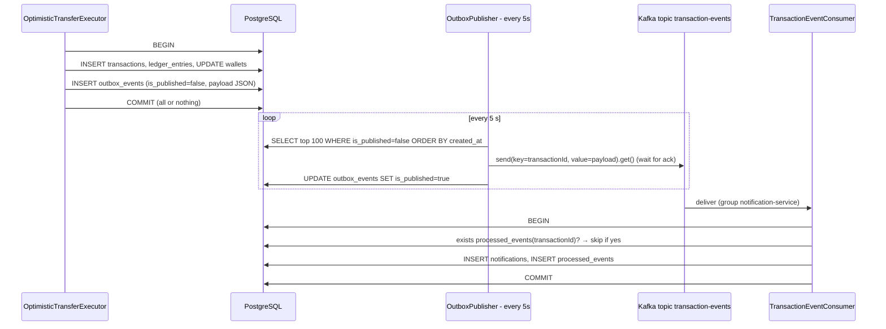

# 12 — Events: Transactional Outbox, Kafka & Notifications

**Files:** `entity/OutboxEvent.java`, `repository/OutboxEventRepository.java`, `service/OutboxPublisher.java`,
`service/TransactionEventConsumer.java`, `entity/ProcessedEvent.java`, `entity/Notification.java`,
`repository/ProcessedEventRepository.java`, `repository/NotificationRepository.java`, `dto/TransferEventPayload.java`,
migrations V8, V9, `PayflowApplication` (`@EnableScheduling`), `docker-compose.yml` (kafka).

## 12.1 The problem: the dual-write

After a transfer commits, other systems should find out (notifications, analytics, fraud checks). The naive approach:

```java
@Transactional
void transfer() {
    ... write DB ...
    kafkaTemplate.send("transaction-events", event);   // ❌
}
```

This breaks either way:
- **Send, then the DB rolls back** → an event announces a transfer that never happened.
- **DB commits, then the send fails** (Kafka down, app crashes) → the transfer happened and nobody is told.

You can't atomically write to two different systems (Postgres and Kafka) without distributed transactions.

## 12.2 The solution: transactional outbox

Write the event **into the same database, in the same transaction** as the transfer. A separate process later copies it to Kafka.



The event exists **if and only if** the transfer committed. Publishing may be late or repeated, but it can never be wrong.

## 12.3 Producing: writing the outbox row

In `OptimisticTransferExecutor.executeTransfer`, after marking the transaction completed:

```java
TransferEventPayload payload = new TransferEventPayload(txId, amount, senderWalletId, receiverWalletId);
String json = objectMapper.writeValueAsString(payload);          // Jackson 3 (tools.jackson)
outboxEventRepository.save(new OutboxEvent(UUID.randomUUID(), txId, json));
```

Payload on the wire:

```json
{ "transactionId": "5a8e…", "amount": 100.00, "fromWalletId": "3f1b…", "toWalletId": "9d2c…" }
```

- `TransferEventPayload` is a plain class (not an entity). Its `@JsonProperty` constructor lets Jackson deserialize it in the consumer
  without a no-arg constructor.
- A serialization failure (`JacksonException`) is wrapped in a `RuntimeException`, which **rolls back the transfer**. No transfer is
  committed without its event.
- ⚠️ **Only the optimistic executor writes outbox rows.** The pessimistic `TransferExecutor` doesn't (chapters 07/08).

## 12.4 Relaying: `OutboxPublisher`

```java
@Scheduled(fixedDelay = 5000)
public void publishOutboxEvents() {
    for (OutboxEvent e : repo.findTop100ByIsPublishedFalseOrderByCreatedAtAsc()) {
        try {
            kafkaTemplate.send("transaction-events", e.getTransactionId().toString(), e.getPayload()).get();  // block for ack
            e.setIsPublished(true);
            repo.save(e);
        } catch (Exception ex) {
            log.error("Failed to publish kafka event for txn {}", e.getTransactionId(), ex);   // retried next poll
        }
    }
}
```

| Aspect | Behaviour |
|---|---|
| Schedule | `fixedDelay = 5000`: 5 s after the previous run **finishes** (runs never overlap). Enabled by `@EnableScheduling` |
| Batch | Oldest 100 unpublished rows |
| Message key | `transactionId`. Kafka routes the same key to the same partition, so events for one transaction stay ordered |
| `.get()` | Waits for the broker ack before marking the row published. Without it, the row would be marked published even if the send later failed |
| Failure | Logged and left `is_published=false`, so the next poll retries |
| Delivery guarantee | **At-least-once.** If the app crashes after the Kafka ack but before `save`, the event is sent again next time. Duplicates are expected, which is why the consumer deduplicates |
| Latency | Up to about 5 s from commit to publish |

Operational notes (chapter 17): no index on `is_published` (the poll scans the table), published rows are never deleted, and if
several app instances run, each polls the same rows. That's still correct thanks to consumer dedup, but wasteful. The standard fix is
`SELECT … FOR UPDATE SKIP LOCKED`.

## 12.5 Consuming: `TransactionEventConsumer` (idempotent consumer)

```java
@KafkaListener(topics = "transaction-events", groupId = "notification-service")
@Transactional
public void handle(String message) throws Exception {
    TransferEventPayload p = objectMapper.readValue(message, TransferEventPayload.class);
    if (processedEventRepository.existsByTransactionId(p.getTransactionId())) {
        log.info("Event already processed");
        return;                                                    // duplicate → skip
    }
    notificationRepository.save(new Notification(UUID.randomUUID(), p.getTransactionId(),
                                "Transfer " + p.getTransactionId() + " completed"));
    processedEventRepository.save(new ProcessedEvent(p.getTransactionId()));
}
```

**At-least-once delivery + an idempotent consumer = effectively-once processing.**

- The **work** (notification) and the **dedup marker** (`processed_events`) commit in the **same DB transaction**. A crash between them
  is impossible: either both exist, or neither exists and the redelivered event is processed then.
- `processed_events.transaction_id` is the **primary key**. If two deliveries race past the `exists` check, the second INSERT violates
  the PK, rolls back, gets redelivered, and is then skipped. The DB is the final guard again.
- Consumer group `notification-service`: every instance of the app shares the group, so each event is handled by one instance. The name
  suggests this consumer could later be split into its own service.

### Consumer failure handling (Spring Kafka defaults)

No custom error handler is configured, so Spring Kafka's `DefaultErrorHandler` applies: a record that keeps failing (for example
malformed JSON) is retried up to **10 times with no delay, then logged and skipped**. A poison message can't block the partition
forever, but it's **lost** (no dead-letter topic). Offsets are committed by the listener container after successful processing.

### Kafka configuration

Everything uses Spring Boot defaults: bootstrap `localhost:9092`, String (de)serializers, `auto-offset-reset=latest`. The JSON is
converted by hand with `ObjectMapper`, so the Kafka layer only sees strings.

## 12.6 Delivery guarantees at a glance

| Stage | Guarantee | Mechanism |
|---|---|---|
| Transfer → outbox | Exactly once, atomic | Same DB transaction |
| Outbox → Kafka | At least once | Poll + ack + mark; retried on failure |
| Kafka → consumer | At least once | Offset committed after processing |
| Consumer effect | Effectively once | `processed_events` PK in the same transaction as the notification |

## 12.7 Observing it locally

```bash
# watch raw events
docker exec -it payflow-kafka /opt/kafka/bin/kafka-console-consumer.sh \
  --bootstrap-server localhost:9092 --topic transaction-events --from-beginning --property print.key=true
```

```sql
select is_published, count(*) from outbox_events group by is_published;
select * from notifications order by created_at desc limit 5;
```

Stop Kafka (`docker stop payflow-kafka`), make a transfer, and it still succeeds; its outbox row stays `false`. Start Kafka again and
within about 5 s it's published and a notification appears. That's the outbox pattern working.

---

## 12.8 Fundamentals: Kafka internals (interview follow-ups)

### Core vocabulary
| Term | Meaning |
|---|---|
| **Topic** | A named, append-only log of messages (`transaction-events`) |
| **Partition** | A topic is split into partitions. Each is an ordered log on one broker. **Ordering is guaranteed only within a partition** |
| **Offset** | A message's position in a partition. Consumers track "how far I've read" as an offset |
| **Key** | Decides the partition (`hash(key) % partitions`). The same key always goes to the same partition, so it's ordered. PayFlow keys by `transactionId` |
| **Broker** | A Kafka server. A cluster has several |
| **Replication factor** | Copies of each partition across brokers. One is the **leader** (serves reads and writes); the others are followers |
| **ISR** | In-sync replicas: followers that are caught up with the leader |
| **Retention** | Messages are kept for a time or size limit whether or not they were consumed, so they can be **replayed** |

### Producer durability: `acks`
- `acks=0`: fire and forget (can lose data).
- `acks=1`: the leader wrote it (lost if the leader dies before followers copy it).
- `acks=all`: every in-sync replica has it. Combined with `min.insync.replicas=2`, a write survives losing a broker.
  (Kafka 3.x clients default to `acks=all` and `enable.idempotence=true`.)
- **Idempotent producer:** the broker deduplicates the *producer's own* retries using sequence numbers. This is **not** the same as
  PayFlow's consumer-side dedup, which handles re-sends by the outbox publisher and redeliveries.

### Consumer groups and rebalancing
- Consumers with the same `groupId` (`notification-service`) **share** the partitions. Each partition is read by exactly one consumer in
  the group. Extra consumers beyond the partition count sit idle.
- Different groups each get **all** messages (that's how a fraud service and a notification service would both consume).
- When a consumer joins, leaves or crashes, the group **rebalances** (partitions are reassigned). Messages processed but not yet
  committed get **re-delivered** to the new owner, which is one more reason consumers must be idempotent.

### Offset commits and delivery semantics
| Semantics | How | Risk |
|---|---|---|
| At-most-once | Commit offset **before** processing | Crash after commit = message lost |
| **At-least-once** (PayFlow) | Commit **after** processing | Crash before commit = reprocessed, so dedup is needed |
| Exactly-once | Kafka transactions (read-process-write *within Kafka*) | Only covers Kafka-to-Kafka; a DB side effect still needs idempotency |

PayFlow's approach, at-least-once plus an idempotent consumer writing its dedup marker in the same DB transaction as its effect, is the
standard way to get exactly-once **effects** with an external database.

### Outbox variations
| Variant | How it relays | Pros / cons |
|---|---|---|
| **Polling publisher** (PayFlow) | `@Scheduled` query for unpublished rows | Simple; adds latency (≤ 5 s) and DB load; needs `SKIP LOCKED` for multiple instances |
| **CDC / log tailing** (Debezium) | Reads the Postgres WAL and emits inserts on the outbox table | Low latency, no polling load, preserves commit order; extra infrastructure |
| **Listen/Notify** | Postgres `NOTIFY` wakes the publisher | Lower latency than polling; notifications are not durable, so you still need polling as a fallback |

### Related patterns worth naming
- **Inbox pattern:** the consumer-side twin of the outbox. PayFlow's `processed_events` is a minimal inbox.
- **Saga:** a sequence of local transactions coordinated by events, with compensating actions on failure. Needed for cross-shard or
  cross-service transfers (chapter 21).
- **Event sourcing:** store the events themselves as the source of truth and derive state from them. PayFlow's append-only ledger is
  close in spirit, but the stored balance remains authoritative.
